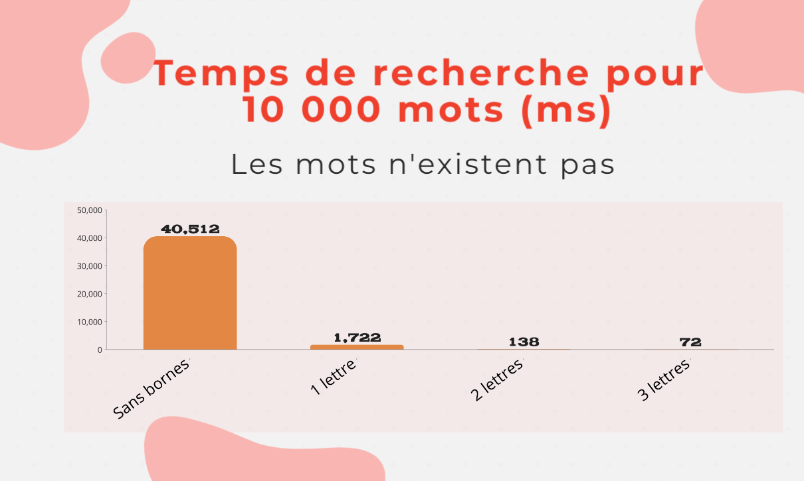
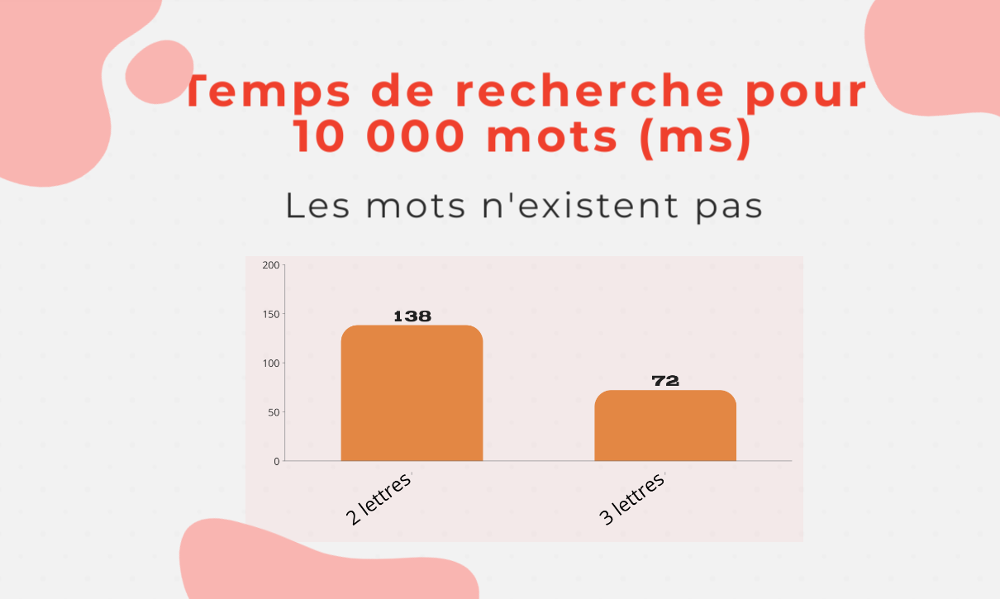

---
jupytext:
  text_representation:
    extension: .md
    format_name: myst
    format_version: 0.13
    jupytext_version: 1.14.5
kernelspec:
  display_name: Python 3 (ipykernel)
  language: python
  name: python3
---

# Rapport de projet Jarnac

+++

## Auteurs

-   RIGGI, Quentin, quentin.riggi@universsite-paris-saclay.fr, LDD1 IM2

+++ {"jp-MarkdownHeadingCollapsed": true}

## Organisation du travail

J’ai réalisé le projet Jarnac seul en environ 35/40h de travail, à raison de 15h par semaine en grande partie le weekend. Afin d’assurer la gestion des versions de mon projet j’ai utilisé Github.

J’ai développé mon projet en plusieurs étapes en priorisant certaines fonctionnalités.
> -   En premier lieu je me suis concentré sur la partie de gestion d’un dictionnaire qui est selon moi le coeur du jeu.
> -   Après suffisamment de tests, j’ai créé une première version du jeu : joueur contre joueur.
> -   Puis je me suis attaqué à la création et l’implémentation d’une IA pour créer un mode joueur contre IA.
> -   Enfin j’ai enrichi cette version avec un mode IA contre IA.
> -   À chaque étape j’ai consigné dans un carnet, avec divers dessins et descriptions, les idées que je souhaitais implémenter et les optimisations que je pouvais mettre en oeuvre.

À la fin du projet, bien que ne connaissant pas le C++, mon père m’a proposé une revue de code pour vérifier la lisibilité et maintenabilité de mon développement, il a notamment mit l’accent sur les points suivants, :

> -   Substitution des valeurs “en dur” dans mon code par des constantes (#define, enums).
> -   Utilisation des noms de variables et fonctions explicites afin d’assurer une compréhension simple.
> -   Ajout de commentaires dans le code pour pouvoir facilement y revenir plus tard.
> -   Limitation de la taille des fonctions et utilisation de sous fonctions pour faciliter la réutilisation et les tests.
> -   Ajout de traces dans un fichier de log.

+++

## Résumé du travail effectué

> -   Recherche de l’existence d’un mot dans un dictionnaire.
> -   Gestion des entrées d’un joueur.
> -   Gestion de l’affichage des plateaux et des messages.
> -   Recherche des meilleurs coups de l’IA dans un dictionnaire à accès optimisé.

+++

## Approfondissement de certaines fonctionnalités

> Pour chercher dans le [dictionnaire](DocDictionnaire.md#création-des-bornes-de-recherche), le programme crée dès son lancement, un vecteur constitué des bornes inférieures et supérieures dans le dictionnaire de toutes les combinaisons de 3 lettres afin de pouvoir accéder directement à la plage de mots débutant par les 3 lettres données ce qui évite un recherche dans tout le dictionnaire.

Pour que l’IA choisisse son meilleur coup [beaucoup d’étapes](DocIA.md#recherche-de-mot-à-allonger) sont intervenues. 
> En premier lieu j’ai supprimé les mots qui étaient des anagrammes l’un de l’autre (par exemple pour NIER RIEN et RENI seulement RIEN a été conservé) car ils permettent d’atteindre les mêmes mots par la suite.

> Une fois cette partie finie, j'ai analysé l'entièreté du dictionnaire pour voir quels mots chaque mots pouvaient atteindre en ajoutant seulement une lettre. Grâce à ces informations j’ai pu créer un structure en arbre où chaque noeud correspond à un mot et les branches qui en partent correspondent aux mots qu’il est possible d’atteindre en ajoutant une lettre.

> Afin de ne pas avoir à parcourir tout l’arbre afin de retrouver un mot j’ai une map qui fait correspondre les mots à leur noeud correspondant.
> De plus, j’ai également une map qui fait correspondre les mots “triés” vers les mots que l’IA connaît (comme l’IA ne connaît que RIEN je trie NIER et RENI afin d’obtenir EINR puis faire correspondre cela avec RIEN).

+++

## Démonstration

|                                             |                              Les mots existent                              |                              Les mots n'existent pas                              |
| :-----------------------------------------: | :-------------------------------------------------------------------------: | :-------------------------------------------------------------------------------: |
| Comparaisons de tous les modes de recherche |  |  |
|      Zoom sur les deux plus efficaces       |       |     |

+++

## Prise de recul

#### Difficultés rencontrées :

> La première difficulté rencontrée concerne l’optimisation de la recherche dans le dictionnaire via un vecteur indexé comprenant pour chaque combinaison de trois lettres la plage de recherche dans le dictionnaire. Les [bornes](DocDictionnaire.md#création-des-bornes-de-recherche) de cette plage ont été encodées dans un entier de type long.

> La seconde difficulté fut la création de la [structure en arbre](DocIA.md#création-de-la-structure-en-arbre) pour l’IA. En effet, bien que je sois très familier avec la programmation objet, la nouveauté des pointeurs en C++ fut sujette à de nombreuses recherches.

#### Pour aller plus loin :

> Si j’avais disposé de plus de temps, j’aurais pu ajouter :
> -   Sauvegarde d’une partie en cours.
> -   Limitation du temps de jeu.
> -   Possibilité pour l’IA d’échanger ses lettres.
> -   Utilisation ponctuelle d’une aide IA par un joueur humain comme joker contre des points.
> -   Création de meilleurs graphismes :
>     -   Gestion de messages via des pop-ups plus visibles (mots impossibles à jouer, Jarnac réussi, …).
>     -   Création d’une interface entièrement graphique.
> -   Gestion du multi-linguisme :
>     -   Utilisation de plusieurs dictionnaires pour différentes langues.
>     -   Utilisation de fichiers externes pour la gestion de toutes les informations textuelles.
> -   Création d’un protocole d'échange des données entre deux IA créées par des développeurs différents.
